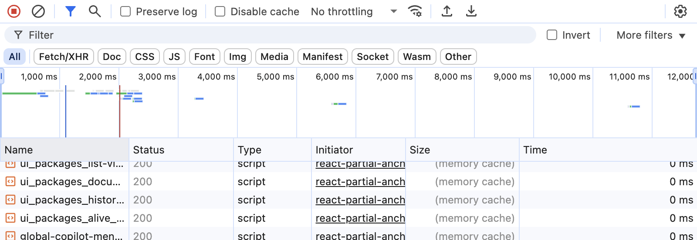

# 03. Web Mapping

We have been discussing the geography of the web and have begun exploring how to use APIs to access and visualize data. In this assignment, we will connect these concepts by creating a web map that visualizes data from a HAR file. A HAR file (HTTP Archive) is a JSON-formatted archive file that contains a log of a web browser's interaction with a site, including requests and responses. This will match the output we observed in the browser's `Network` tab and represents the list of requests made by the browser to load a web page. 

## 1. Clone the Repository
Clone the following repository to your local machine: https://github.com/mapping-systems/geolocate-har-file. This repository contains a script that will read a HAR file and extract the URLS of the requests made by the browser. Open `scrape_har_locations.py` and read through the code to understand the primary operations it performs. Install the dependencies if needed. 

## 2. Obtain a HAR File
Use your web browser to navigate to a website of your choice. Open the developer tools and go to the `Network` tab. Make sure to clear any existing logs, then refresh the page to capture all requests made by the browser. Once the page has fully loaded, navigate around a bit. You should see a stream of requests. In the tab's menu bar, you should see an icon that indicates that network traffic is being recorded, as well as an option to download the HAR file. Click on the download icon to save the HAR file to your local machine. The below example shows the `Network` tab in Chrome:

Save the HAR file in the `inputs` directory in the newly cloned repo.

## 3. Run the Script
Run the `scrape_har_locations.py` script in the terminal (`python scrape_har_locations.py`). This script will read the HAR file you saved and extract and geocoded the URLs of the requests made by the browser. It will produce a GeoJSON file, as well as an HTML file that contains a web map visualizing the locations of the requests. You should be able to open the HTML file in your web browser using the Live Server extension in VS Code or by double-clicking the file.

## 4. Add the GeoJSON File to a Web Map
Now that you have a GeoJSON file, you can visualize it on a web map. (You can reference the webmap we created in class.) **Create a web map** that loads the GeoJSON file as a layer and displays the locations of the requests on the map. Note that unlike the API endpoint we used in class, the GeoJSON file is a static file that already contains the properly formatted geometry data.

## Submission instructions
Please submit:
- a screenshot of the web map you created
- the GeoJSON file generated by the script
- a link to the folder containing your web map files (HTML, CSS, JS, etc.). I should be able to launch and run the web map from this link.