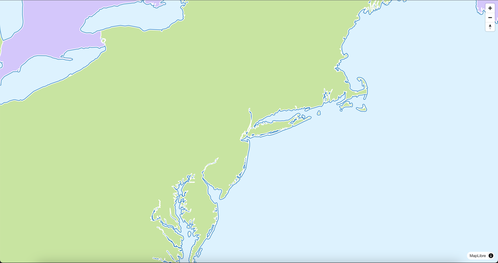
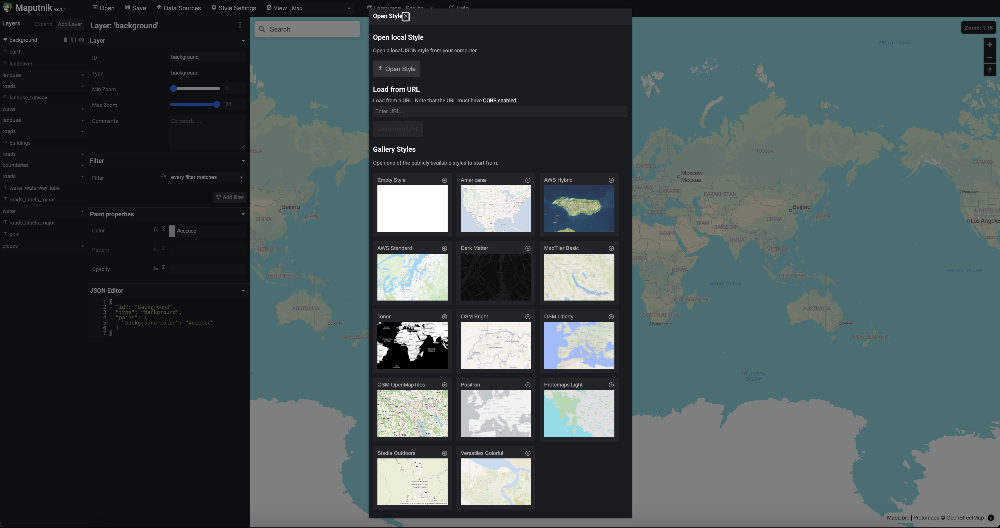
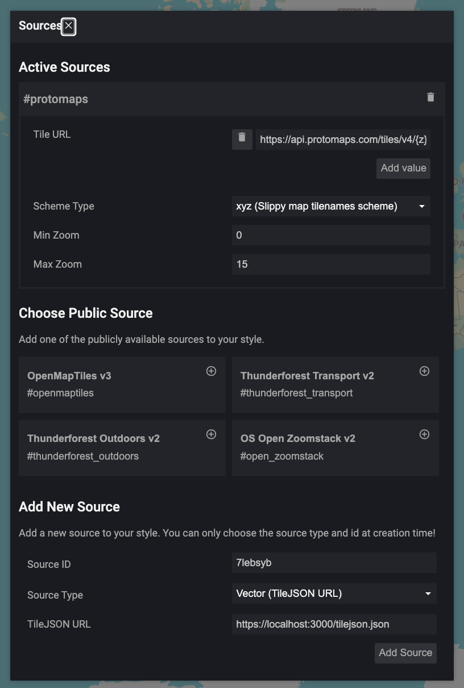
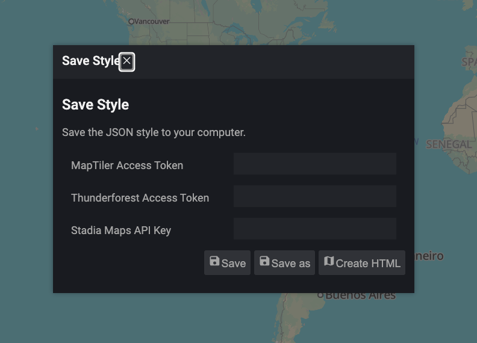
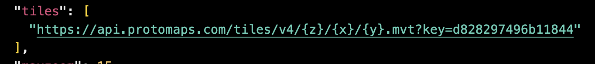
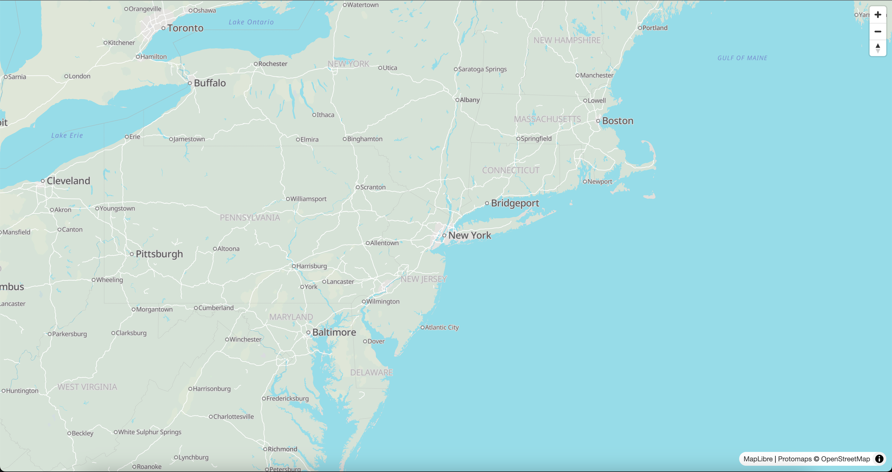

# 03. Making a web map with Maplibre

To this point, we have been working with data in Python and (mostly) visualizing it in our Jupyter notebooks. Now we will take the next step and create a series of files that together comprise a web map that we will then publish. This exercise will be done in two parts. In this first part, we will create the files that will be used to display the map and a basic dataset on a web page. In the second part, we will serve more complex data to our site and publish the map to a web server.

Our map will consist of three files, each of which performs a specific function:

1. An HTML file (`index.html`) that will display the map and the data. This file will contain the _structure_ of our web page, and will invoke the other two files.
2. A JavaScript file (`main.js`) that will contain the code to create the map and add the data to it. This file will contain the _logic_ of our web page.
3. A CSS file (`style.css`) that will contain the styles for our web page. This file will contain the _style_ of our web page.

## 1. Create the HTML file

We will start by creating the HTML file that will serve as the structure of our web page.
Create a new file called `index.html` in your project directory and add the following code to it:

```html
<!DOCTYPE html>
<html>
  <head>
    <title>A super cool website</title>
    <meta charset="utf-8" />
    <meta name="viewport" content="width=device-width, initial-scale=1.0" />
  </head>
  <body>
    <!-- we'll add content here later -->
  </body>
</html>
```

This code creates a basic HTML document with a title and the necessary meta tags for character encoding and responsive design. The `<body>` tag is currently empty, but we will add content to it later. We'll also add links to the JavaScript and CSS files that we will create in the next steps. The head is also where we can link to external libraries, which we will use to create our map.


The primary library we will use is: 
-`Maplibre`: Leaflet is a popular open-source JavaScript library for interactive maps. It provides an easy-to-use API for creating maps and adding layers, markers, and other features. We will use Leaflet to create our map and add data to it.

Per the [Maplibre documentation](https://maplibre.org/maplibre-gl-js/docs/#cdn), we can include the library in our HTML file by adding the following lines to the `<head>` section:

```html
<!-- previous head content... -->
<script src="https://unpkg.com/maplibre-gl@^5.6.1/dist/maplibre-gl.js"></script>
<link href="https://unpkg.com/maplibre-gl@^5.6.1/dist/maplibre-gl.css" rel="stylesheet" />
<!-- add before the closing </head> tag -->
```

The first item, the `<script>` tag, includes the Leaflet JavaScript library, and the second item, the `<link>` tag, includes the Leaflet CSS file. Together, these two lines will allow us to use Maplibre to create our map.

Altogether, the `<head />` in your `index.html` file should look like this:

```html
<!DOCTYPE html>
<html>
  <head>
    <title>A super cool website</title>
    <meta charset="utf-8" />
    <meta name="viewport" content="width=device-width, initial-scale=1.0" />
    <script src="https://unpkg.com/maplibre-gl@^5.6.1/dist/maplibre-gl.js"></script>
    <link href="https://unpkg.com/maplibre-gl@^5.6.1/dist/maplibre-gl.css" rel="stylesheet" />
  </head>
</html>
```

Note that you may need to adjust the version numbers in the URLs to match the latest version of Maplibre at the time you are working on this project. You can find the latest version on the [Maplibre download page](https://maplibre.org/maplibre-gl-js/docs/#cdn).

Now that we have the basic structure of our HTML file, we can move on to the next step, which is to create the JavaScript file that will contain the code to create the map and add data to it.

## 2. Create the JavaScript file

Next, we will create the JavaScript file that will contain the code to create the map and add data to it. Create a new file called `main.js` in your project directory and add the following code to it:

```javascript
  var map = new maplibregl.Map({
        container: 'map', // container id
        style: 'https://demotiles.maplibre.org/style.json', // style URL for basemap
        center: [-73.97144, 40.70491], // starting position [lng, lat]
        zoom: 6 // starting zoom
    });
```

Let's break down what this code does:

- We begin by creating a new `map` variable that will hold our map object. We set that variable equal to a new instance of the `maplibregl.Map` class, which is provided by the Maplibre library, and pass it an object with several properties, including:
  - `container`: This is the ID of the HTML element that will contain the map. We will create this element in the next step.
  - `style`: This is the URL of the style for the base map. In this case, we are using a demo style provided by Maplibre, but you can use your own style or a different one from another provider.
  - `center`: This is the initial center of the map, specified as an array of longitude and latitude coordinates. In this case, we are centering the map on New York City.
  - `zoom`: This is the initial zoom level of the map.

Return to your `index.html` file and add a `<div>` element inside the `<body>` tag to serve as the container for the map. This is where the map will be displayed. We will also invoke the `main.js` file at the end of our `body` section. Add the following code inside the `<body>` tag:

```html
<body>
  <div id="map" style="height: 100vh;"></div>
  <script src="main.js"></script>
</body>
```

For now, we are setting the height of the map to `100vh`, which translates to 100 view height units (i.e. take up the entire view height) but you can adjust this value as needed. The `id` attribute of the `<div>` element is set to `map`, which matches the identifier we used in the JavaScript code to create the map. Later we will pull this out into a separate CSS file to style it further.

#### Adding map controls
We'll also add a code snippet to make it clear to users how to pan and zoom around the map. Maplibre provides built-in controls for zooming and panning, which we can add to our map by using the `addControl` method. Add the following code to your `main.js` file, after the code that creates the map:

```javascript
map.addControl(new maplibregl.NavigationControl());
```

Ok, now let's take a look at what we have so far. To view your web map, make sure you have installed the [Live Server extension in VS Code](https://marketplace.visualstudio.com/items?itemName=ritwickdey.LiveServer) and then right-click on the `index.html` file and select "Open with Live Server". This will start a local web server and open your web map in a new browser tab.

You should see the following map displayed in your browser:



You should be able to pan and zoom the map. Although this is a very basic example, we are leveraging some important web technologies to create an interactive map, namely, we are requesting map tiles from a remote server (OpenStreetMap) and displaying them in our web browser using JavaScript (in <30 total lines of code no less!).

## 3. Create the CSS file

Finally, we will create a CSS file to style our web page. There is a whole wide world of styling available to us, but for now we'll just clean up a few minor items to get started. You may have noticed that there is a bit of white space around the map in the browser. This is because the default margin and padding for the `<body>` element is set to 8px in most browsers. We can remove this by adding some CSS to our page.


It's a minor detail, but it can be distracting when working with maps. We can also set the font family for the page to something more modern and readable. We'll also refactor the `map` element to not have in-line styles, but rather to use the `id` identifier `#` to refer to it in our css file. Note that `body` doesn't need any identifier, as it is a global element that applies to the entire page. (CSS `classes` use the `.` identifier, for example, but we will not be using those yet).

Create a new file called `style.css` in your project directory and add the following code to it:

```css
body {
  margin: 0;
  padding: 0;
  font-family: Arial, sans-serif;
}

#map {
  width: 100%;
  height: 100vh;
}
```

## 4. Designing a better basemap
The demo map style provided by MapLibre is intended to be used for testing purposes, but it is not very visually appealing. We can use a tool called [Maputnik](https://maputnik.github.io/) to design our own map style. Head to Maputnik's editor to begin designing your own style. You can start with a blank canvas or choose from one of the existing styles. For this tutorial, we will use the "Protomaps Light" style as a starting point, in part so that we can use Protomaps' [API](https://protomaps.com/api) to serve our map tiles later.



Spend a few minutes making changes to your map style using the GUI or the JSON interfaces. You can change the colors, fonts, and other visual elements of the map to create a style that you like. Once you are satisfied with your style, click the "Data Sources" button in the top panel of the Maputnik interface. This will expose a `Tile URL` value that we can use to power our map.



The url should look something like this:

```https://api.protomaps.com/tiles/v4/{z}/{x}/{y}.mvt?key=d828297496b11844```

We can see that we are requesting tiles from the Protomaps API, and that the URL contains placeholders for the zoom level (`{z}`), x coordinate (`{x}`), and y coordinate (`{y}`) of the tile. There will be a key at the end that lets us test the API, but you will need to sign up for an account to get your own key for production use (we'll do that in a moment).

Click `Save` in the top panel of the Maputnik interface to save your style. Click save when prompted to enter in an API key (we'll do that next).



A JSON file will be downloaded to your computer. Open it and scroll through: the style elements you defined in the interface are all there, and you can see how the style is defined in JSON format. Toward the top you'll see a `tiles` key with the same protomaps URL we saw in the interface:



Go to protomaps and [create an account](https://protomaps.com/account#). Protomaps is free for non-commercial use, but you will need to create an account to get an API key. Once you have created an account, you can find your API key in the "Keys" section of your account page. Copy the key and replace the `key` parameter in the `Tile URL` with your own key.


## 5. Adding the style to our map
Now that we have our own map style, we can use it in our web map. Copy the style json file into your project directory and rename it to `style.json`. Then, update the `style` property in the `main.js` file to point to your new style:

```javascript
var map = new maplibregl.Map({
  container: 'map', // container id
  style: 'style.json', // style URL for basemap
  ... // other properties
});
```

Make sure and add your API key to the `style.json` file in the `tiles` property, replacing the `key` parameter with your own key. Your `style.json` file should look something like this:

You should now be able to load the map with your custom style. If you open your web map in the browser, you should see the new style applied to the map.




You may want to adjust the starting zoom level to `10` to focus more directly on NYC.

## 6. Adding data to the map

Now that we have the basic structure of our web page and the map, we can add some data. In the next part of this tutorial, we will consider adding data from different source types, but for now we will add data from the New York City's Open Data portal API. We will load restaurant data and display it on the map as a point layer.

Navigate to the [DOHMH Restaurant Inspection Results dataset](https://data.cityofnewyork.us/Health/DOHMH-New-York-City-Restaurant-Inspection-Results/43nn-pn8j/about_data) on the NYC Open Data portal. This dataset contains information about restaurant inspections in New York City, including the name of the restaurant, its address, and the inspection results.

We can see on the open data portal's website that each dataset has an `Actions` dropdown, and within that there's an `API` option:


The API endpoint given there is how we will programmatically access the data; instead of downloading and then serving the data from our website, we will simply make a request to this service and load from there.

However, we'll need to both filter the data to not exceed the maximum number of records returned (which is 1000) and to transform the data into a format that Leaflet can understand. We will use the `geojson` format, which is a common format for representing geographic data.

To do this, we will use the `fetch` API in JavaScript to make a request to the API endpoint and then process the data. We will add this code to our `main.js` file.

Add the following code to your `main.js` file, after the code that creates the map:

```javascript
// Fetch pizza restaurant data from the NYC Open Data API
const jsonFeatures =  fetch(
  "https://data.cityofnewyork.us/resource/43nn-pn8j.geojson?cuisine_description=Pizza&$limit=10000"
)
  .then((response) => response.json())
  .then((data) => {
    // do something with the data
  })
  .catch((error) => console.error("Error fetching data:", error));
```

This code uses the `fetch` API to make a request to the NYC Open Data API endpoint for pizza restaurants. The `cuisine_description=Pizza` query parameter filters the data to only include pizza restaurants, and the `$limit=10000` parameter increases the maximum number of records returned to 10,000. We will then chain a series of `.then()` methods to process the data once it is returned. This is a common pattern in JavaScript for handling asynchronous operations like fetching data from an API. The first `.then()` method converts the response to JSON format, and the second `.then()` method will be used to process the data. The `.catch()` method will log any errors that occur during the fetch operation.

Next we'll reshape the raw `JSON` that's returned into a format that Leaflet can understand. Copy and paste query above into your browser. You should see something like the following:


There's a lot of information here, including a `latitude` and `longitude` for each restaurant, but mapping libraries expect a specially-formatted `geometry` field. We can use an iterator to loop through the `features` array in the JSON response and create a new array of objects that contains the `geometry` and `properties` fields that Leaflet expects.

Add the following code to your `main.js` file, inside the second `.then()` method:

```javascript
data.features.forEach((feature) => {
  feature.geometry = {
    type: "Point",
    coordinates: [
      Number(feature.properties.longitude),
      Number(feature.properties.latitude),
    ],
  };
});
```

What we're doing is requesting _for each_ feature, to return a new `geometry` object that contains the `type` (which is always `Point` for our purposes) and the `coordinates`, which we are converting to numbers from strings. This will allow Leaflet to understand the data and display it on the map. However, this doesn't actually add the data to the map yet. We still need to create a layer and add it to the map.

Within the same second `then(...)` method, we need to add some additional code below the `forEach` loop to create a layer and add it to the map. We'll now operationalize the `map.on('load', () => {...})` event callback to tell our app to wait for the basic map object is done loading before proceeding. Within that we add a source named `restaurants` that points to our processed `data` object. We then add a layer named `restaurants-layer` that uses the `circle` type to display the data as circles on the map. The `paint` property allows us to customize the appearance of the circles based on the `score` property of each restaurant.


```javascript
    map.on('load', () => {        
      map.addSource('restaurants', {
          type: 'geojson',
          data: data
      });

      map.addLayer({
          'id': 'restaurants-layer',
          'type': 'circle',
          'source': 'restaurants',
      });
    })
```


## 7. Styling the markers
This is fine, but not super legible. We can improve the appearance of the markers by adding some styles to the layer. We can do this by passing a `paint` property to the `addLayer` method. Update the `addLayer` code to include the following `paint` property:

```javascript
    map.addLayer({
      id: "restaurants-layer",
      type: "circle",
      source: "restaurants",
      paint: {
        "circle-radius": 6,
        "circle-stroke-width": 2,
        "circle-color": "#ff7800",
        "circle-stroke-color": "white",
      },
    });
```

As you can see, there are a range of paint options that you can pass to style your layers. You can additionally style by data-driven properties, which we'll get into later.

Our map should now look like this:


## 8. Add interactivity to the map

Finally, we can add some basic interactivity to the markers by adding a popup that displays the name of the restaurant when the marker is clicked. We can do this by registering another event listener to out map, similar to the `load` even we listened for previously.

In this case, we look for a `click` event on the `restaurants-layer` layer, and then create a new popup that displays the name of the restaurant. The `e` parameter is a shorthand for the event object, which contains information about the clicked feature. We can access the `geometry` and `properties` of the clicked feature using `e.features[0].geometry` and `e.features[0].properties`, respectively. The `[0]` index is used because the `features` array can contain multiple features, but we are only interested in the first one (in this case).

Within the event, we can create a `coordinates` variable that stores the point location, as well as a `description` variable that holds the "Doing Business As" (DBA) name of the restaurant. We are creating a generic HTML object here, meaning we can add in other text, images, and so on. We then create a new `maplibregl.Popup` object, set its longitude and latitude to the coordinates of the clicked feature, and set its HTML content to the description. Finally, we add the popup to the map.

```javascript
    map.on("click", "restaurants-layer", (e) => {
      const coordinates = e.features[0].geometry.coordinates.slice();
      const description = e.features[0].properties.dba
      new maplibregl.Popup()
        .setLngLat(coordinates)
        .setHTML(description)
        .addTo(map);
    });
```

You should now be able to click on a marker and see a popup with the name of the restaurant. If you click on a marker, you should see something like this:


This concludes the first part of our web mapping tutorial. We have created a basic web map using Leaflet, added a tile layer, and displayed data from the NYC Open Data API as a point layer on the map. We have also added some basic interactivity to the markers by binding popups to them. In the next part of the tutorial, we will explore how to serve more complex data to our site via an API that we create, and publish the map to a web server. 
