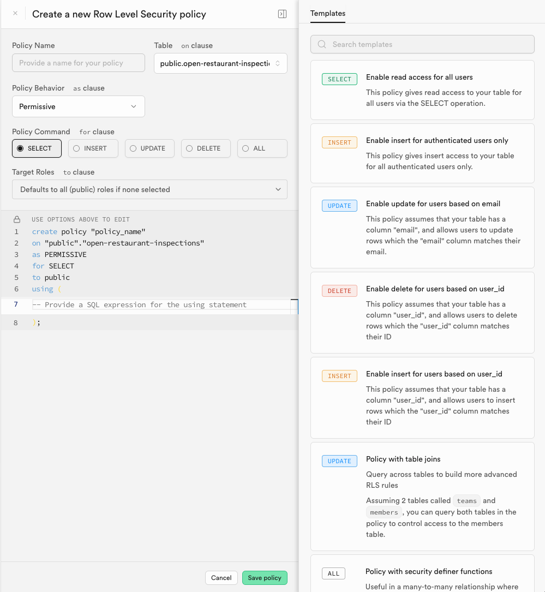

# 04. Web Mapping (Part 2)
In this part of the tutorial, we will build upon the previous assignment by adding additional data layers to our web map. We will also explore how to add additional interactivity to the map using JavaScript. Finally, we will launch our web map onto the internet using a free hosting service.

## Adding a link to our backend API
In the previous assignment, we created a web map that pulled directly from NYC Open Data. Now we'll set up a link to a backend API that will allow us some additional control over what is being shown, and how it is being served to our app. We'll use `supabase` as our backend API, which is a popular modern database+API combination. Add the supabase files to your web map `head`:

```html
<!-- files you already link to -->
<script src="https://unpkg.com/maplibre-gl@^5.6.1/dist/maplibre-gl.js"></script>
<link href="https://unpkg.com/maplibre-gl@^5.6.1/dist/maplibre-gl.css" rel="stylesheet" />

<script src="https://cdn.jsdelivr.net/npm/@supabase/supabase-js@2"></script>
```

Now that we are able to use the library, we need to create an account on Supabase and create a new project. Once you have created a project, you will be able to access your API keys. You will need to add these keys to your web map in order to connect to the Supabase API. Navigate to [the Supabase signup](https://supabase.com/dashboard/sign-up?returnTo=%2Forganizations) and create a new account.

## Getting data 
Now let's get some data to visualize. We will keep using the restaurants dataset loaded via the NYC Open Data API, but now we can get other data from the portal to load into our web map. For example, we will use a complementary dataset, the inspections for Open Restaurants. [Navigate to the portal](https://data.cityofnewyork.us/Transportation/Open-Restaurants-Inspections/4dx7-axux/about_data) and download the dataset as a CSV. 


## Loading the data into Supabase
Now that we have some data, let's load it into Supabase. Applications often refer to datasets as "tables" in a database, so we will create a table in Supabase to hold our data. In Supabase, navigate to Table Editor and create a new table called `open-restaurant-inspections`. Since we are importing data from a CSV, we can click on the `Import from CSV` button and upload the CSV file we downloaded earlier. 


Drag your CSV file into the upload area, and then click on the `Import` button. Supabase will automatically create the table schema based on the CSV file. Once the import is complete, you should see your data in the table. 


## Adding a primary key
Supabase warns that we will not be able to update the table if we do not have a primary key. A primary key is a unique identifier for each row in the table. In our case, we can use the `RestaurantInspectionID` column as the primary key. To set this, click on the `Columns` tab and then click on the `Edit` button next to the `RestaurantInspectionID` column. Check the box that says `Primary Key` and then click on `Save`.


The primary key is now set, and we can update the table as needed. A primary key is a crucial part of a database schema, as it allows us to uniquely identify each row in the table.

## Enabling spatial queries
As of now, our table does not have any spatial powers- to enable it to handle spatial data (and serve data to our web map), we need to enable PostGIS on the table. PostGIS is a spatial database extender for PostgreSQL, and it allows us to perform spatial queries on our data. To enable PostGIS, we can navigate to `Database` > `Extensions` and then click on the `PostGIS` extension to enable it:


Create a new schema called `gis`. Click to confirm. 


## Adding a geometry column
Now that we have PostGIS enabled, we can add a geometry column to our table. Like we've seen in Python and through manipulating JSON, a geometry column is a special column that holds spatial data. In our case, we will add a geometry column called `geometry` to our `open-restaurant-inspections` table using the `Latitude` and `Longitude` columns. From the sidebar, click `SQL Editor` and then select to create a new snippiet. Consider the following lines:

```sql
ALTER TABLE public."open-restaurant-inspections"
ADD COLUMN geometry gis.geography(POINT, 4326);
```

First off, we are declaring that we want to alter the `open-restaurant-inspections` table, which lives in the `public` schema. We then say that we want to add a column called `geometry`, using the `gis.geography` type. The `gis` prefix indicates that we are using the PostGIS extension from the schema we just created, which provides spatial data types and functions. The `geography` type is used to store geographic data, similar to how we were working in geopandas. We pass the `POINT` type as an argument, which indicates that we are storing point data in the `4326` CRS.

## Creating the spatial index
Now that we have added the geometry column, we can create a spatial index on it. A spatial index is a special type of index that allows us to perform spatial queries on our data efficiently. To create a spatial index, we can run the following SQL command:

```sql
CREATE INDEX open_restaurant_inspections_geometry_idx
ON public."open-restaurant-inspections"
USING gist (geometry);
```


At this point, the column is created, but it is empty. We need to populate it with the actual point data derived from the `Latitude` and `Longitude` columns. We can add additional arguments to the SQL command. 

```sql
UPDATE public."open-restaurant-inspections"
SET geometry = gis.ST_SetSRID(
    gis.st_makepoint(
        "Longitude"::double precision,
        "Latitude"::double precision),
    4326
)
```

We are stating that we want to `update` our newly created geometry column (within the schema and table) and `set` its value. The function above chains a few different PostGIS functions together. Let's work from the inside out:
- `gis.st_makepoint("Longitude"::double precision, "Latitude"::double precision)` creates a point geometry from the `Longitude` and `Latitude` columns. The `::double precision` casts the values to the appropriate type for geographic coordinates. (By default, they are stored as strings in the CSV.)
- `gis.ST_SetSRID(..., 4326)` sets the SRID (Spatial Reference Identifier) of the point geometry to 4326, which is the standard for WGS 84 coordinates (latitude and longitude). Recall that we already set the SRID on the *column*; now we are declaring that the actual data we are inserting into the column is also in this system.

Try running the SQL command in the editor. What do you see?


The error `ERROR:  22P02: invalid input syntax for type double precision: ""` indicates that there are empty strings in the `Longitude` or `Latitude` columns. This is common in datasets where some rows may not have valid coordinates. We *could* modify our original dataset To handle this, we can modify our SQL command to only update rows where both `Longitude` and `Latitude` are not empty and can be cast as valid numbers. We can use a regular expression to check if the values are valid numbers before attempting to create the point geometry:

```sql
UPDATE public."open-restaurant-inspections"
SET geometry = gis.ST_SetSRID(
    gis.st_makepoint(
        "Longitude"::double precision,
        "Latitude"::double precision),
    4326
)
WHERE "Longitude" ~ '^[+-]?[0-9]+(\.[0-9]+)?$' AND "Latitude" ~ '^[+-]?[0-9]+(\.[0-9]+)?$';
```

Try running this updated SQL command. This command will only update rows where both `Longitude` and `Latitude` are valid numbers, preventing the error from occurring. You should see a clean update with no errors. Now if you navigate back to the `Table Editor`, you should see that the `geometry` column is populated with point geometries based on the `Longitude` and `Latitude` columns. The geometry is stored as `WKB` (Well-Known Binary) format, which is a standard way to represent geometric objects in a binary format, as opposed to the more human-readable `WKT` (Well-Known Text) format we used in Python and GeoJSON.

## Granting access to the GIS schema
Now that we have our data in the `open-restaurant-inspections` table, we need to grant access to the `gis` schema so that we can query the data from our web map. We will use SQL to grant access to the `gis` schema. In the SQL editor, run the following command. Be sure to either comment out or remove the code you had run previously (SQL commands are run in order, so if you try to run the same command twice, it will throw an error). You can comment out a line by adding `--` at the beginning of the line.:

```sql
-- ...other code you ran before
GRANT USAGE ON SCHEMA gis TO anon, authenticated;
```


## Accessing the data from our browser
Now that we have data in our database, we need to make a connection to it in our web map. Supabase provides a JavaScript library that allows us to interact with our database easily. We can use this library to query our data and display it on the map. The first thing we need to do is to add the Supabase library to our site header. Head to the [Install va CDN](https://supabase.com/docs/reference/javascript/introduction) portion of their intro page and copy the script tag to your web map's `head`. You may need to update the version number to the latest one available. It should look something like this:

```html
<script src="https://unpkg.com/@supabase/supabase-js@2"></script>
``` 

We will be setting up a connection to a server, and need to create what's called a "client" in Supabase. We will import a helper function from the Supabase library to create a client. Add the following code to your JavaScript file:

```javascript
const { createClient } = window.supabase;
const supabaseUrl = 'https://your-project-ref.supabase.co';
const supabaseKey = 'your-anon-key';
const supabaseClient = createClient(supabaseUrl, supabaseKey);
```

In the above, we:
- Import the `createClient` function from the Supabase library.
- Define the `supabaseUrl` and `supabaseKey` variables with your project's URL and API key. You can find these in your Supabase project settings under the "API" section.
- Create a Supabase client instance using the `createClient` function. This "client" is what will be doing the transactions with the database.

To get the correct values for `supabaseUrl` and `supabaseKey`, navigate to your Supabase project dashboard, click on "Project Settings" in the sidebar, and then click on "App Frameworks". You'll see the data formatted for Next.js, prepended by `NEXT_PUBLIC_`. Copy the corresponding values to your JavaScript file.

That's great, but we still need to be able to query our data. We can use the Supabase client to query our `open-restaurant-inspections` table and retrieve the data we need. We will make an *asynchronous* function to fetch the data from the database, meaning that we can use the `await` keyword to wait for the data to be returned before continuing. Add the following code to your JavaScript file:

```javascript
async function querySupabase() {
    const { data, error } = await supabaseClient
        .from("open-restaurant-inspections")
        .select("*")
        .limit(100);

    if (error) {
        console.error("Error fetching data:", error);
    } else {
        console.log("Data fetched successfully:", data);
    }
}
```

In this code snippet, we can see how we are using our client to query the `open-restaurant-inspections` table. We are selecting all columns (`*`) and limiting the results to 100 rows. If there is an error, we log it to the console; otherwise, we log the fetched data. The way that the `.from` and `select` methods are chained together is similar to how we would use a SQL query, but in a more JavaScript-friendly way. This query is the equivalent of running a SQL command like `SELECT * FROM open-restaurant-inspections LIMIT 100;`.


Finally, let's invoke the `querySupabase` function to fetch the data when the page loads. Add the following code at the end of your JavaScript file:

```javascript
document.addEventListener("DOMContentLoaded", () => {
    querySupabase();
});
```
This code listens for the `DOMContentLoaded` event, which fires when the initial HTML document has been completely loaded and parsed. When this event occurs, it calls the `querySupabase` function to fetch the data from the database.

Head back to your web map and open the console. What do you see? If you seen an error, check that you have the correct `supabaseUrl` and `supabaseKey` values. If you see a success message but no data, we can move on to allowing the client proper access to the data.


## Creating a row access policy
Supabase (and most databases) have a concept of row-level security, which allows us to control who can access what data. By default, Supabase does not allow any access to the data in your tables. We need to create a row access policy that allows our web map to read the data from the `open-restaurant-inspections` table.

In the "Database" section of your Supabase project, navigate to "Policies" and then click on "Create Policy". You'll see a panel apper that shows you the options for creating a new policy. This include how users can interact with the data, whether they can view ("SELECT") or otherwise modify it using the other access types.



Make sure you select an option from the sidebar, and then name your policy something straightforward like "public read access" and click to save the policy. This will create a policy that allows anyone to read the data from the `open-restaurant-inspections` table.

Now if you refresh your web map and check the console, you should see the data being logged successfully. If you still see an error, double-check that you have created the policy correctly and that it is enabled.


## Adding the data to the web map
We are able to access the data from our database, but at this point we have not yet added it to our web map. We can use the data to create a new layer on the map that displays the restaurant inspections. Remember that the data we are working with is in the `WKB` format, which is not directly compatible with MapLibre. We will need to convert the `WKB` geometries to GeoJSON before adding them to the map. Furthermore, we need to decide under what conditions we want to display the any or all of the 80,000+ points on the map.

We'll explore a couple of different options, each of which leverages the capabilities of the *server* to perform spatial operations vs relying on the client to do so. This is a fundemental shift from last week, where we were relying on the client to do all the work. Instead of writing functions in JavaScript to filter the data, we can use SQL queries to filter the data on the server side. This is more efficient and allows us to work with larger datasets without overwhelming the client.

First, let's create a function that finds all points within a certain distance of a given location. This will allow us to filter the data based on a clicked point using SQL. 

```sql 

create or replace function find_nearest_n_restaurants(
    lat double precision,
    lon double precision,
    n integer
)

returns table (RestaurantInspectionID public."open-restaurant-inspections"."RestaurantInspectionID"%TYPE, 
               name public."open-restaurant-inspections"."RestaurantName"%TYPE, 
               seating_choice public."open-restaurant-inspections"."SeatingChoice"%TYPE,
               lat double precision, 
               long double precision, 
               dist_meters double precision)
set search_path = ''
language sql as $$
    select "RestaurantInspectionID", "RestaurantName", "SeatingChoice", gis.st_y(geometry::gis.geometry) as lat, gis.st_x(geometry::gis.geometry) as long, gis.st_distance(geometry, gis.st_point(lon, lat)::gis.geography) as dist_meters
    from public."open-restaurant-inspections"
    where gis.st_dwithin(geometry, gis.st_point(lon, lat)::gis.geography, n)
    order by geometry operator(gis.<->) gis.st_point(lon, lat)::gis.geography;
$$;
```

Let's break down this operation. The first block (`create or replace function...`) defines a function name, and gives an indication of what input variables are required (`lat`, `lon`, and `n`), where `lat` and `lon` are based on the point clicked, and `n` represents the search radius in meters.
The `returns table` clause specifies the columns that will be returned by the function, including the restaurant ID, name, seating choice, latitude, longitude, and distance from the clicked point. SQL requires that we specify the types of each column, which we can do by referencing the table and column names in the `public.open-restaurant-inspections` table. Instead of referencing each type directly, we can use the `%TYPE` operator to get the type of a column from a table. This is useful for ensuring that our function returns the correct types, even if the table schema changes in the future.

The `set search_path = ''` line sets the search path to an empty string, which means that the function will not use any specific schema. This is useful if we want to avoid conflicts with other schemas in the database. The `language sql as $$` line indicates that the function is written in SQL.

Next we have our select statement. The first line selects the columns we want to return, including the restaurant ID, name, seating choice, latitude, longitude, and distance from the clicked point. The `gis.st_y(geometry::gis.geometry)` and `gis.st_x(geometry::gis.geometry)` functions extract the latitude and longitude from the `geometry` column, which is in `WKB` format. The `gis.st_distance(geometry, gis.st_point(lon, lat)::gis.geography)` function calculates the distance between the restaurant location and the clicked point in meters.

The `where` clause filters the results to only include restaurants that are within the specified distance *n* that we passed in previously. 

Finally, we `order by` the results based on the distance from the clicked point, using the `operator(gis.<->)` operator to calculate the distance between the restaurant location and the clicked point. Together, this function will return a table of inspection results that are within the specified distance from the clicked point, ordered by distance.

Once we run this code in the SQL editor, we can call this function from our JavaScript code to get the nearest restaurants to a clicked point as `find_nearest_n_restaurants`.

## Querying the data on click
Now that we have our function set up, we can use it to query the data when a user clicks on the map. We will add an event listener to the map that listens for `click` events. When a user clicks on the map, we will get the latitude and longitude of the clicked point and call the `find_nearest_n_restaurants` function to get the nearest restaurants. We can pass in a search radius as well. For now we'll make it static, but you could easily add a slider to your web map to allow users to adjust the search radius or change it dynamically based on the zoom level of the map.

Let's create a new Javascript function to connect to our database function. 

```javascript
async function queryWithinDistance(point, n = 1000) {
        const { data, error } = await supabaseClient.rpc(
          "find_nearest_n_restaurants",
          {
            lat: point[1],
            lon: point[0],
            n: n,
          }
        );

        if (error) {
          console.error("Error fetching nearest points:", error);
        } else {
          console.log("Nearest points fetched successfully:", data);
          // do other stuff here later...
        }
      }
```

Again, we are writing an asynchronous function that will query the database. We are using the `rpc` method of the Supabase client to call our `find_nearest_n_restaurants` function, passing in the latitude and longitude of the clicked point and the search radius. If there is an error, we log it to the console; otherwise, we log the fetched data. Note that in the input we set a default value for `n` to 1000, which is the search radius in meters. You can change this value to whatever you like, or pass in a different value when calling the function.

Now we need to invoke this function when the user clicks on the map, similar to last week. Instead of binding the click event to a specific layer, we can bind it to the entire map. Add the following code to your JavaScript file within the `map.on('load', () => { ... })` function:

```javascript
map.on("click", (e) => {
    const point = [e.lngLat.lng, e.lngLat.lat];
    queryWithinDistance(point, 1000); 
});
``` 

With this, every time the user clicks on the map, we will get the latitude and longitude of the clicked point and call the `queryWithinDistance` function to fetch the nearest restaurant inspection results within 1000 meters. Go back and click on your map- you should see the results logged in the console:


## Casting the data as a point layer
Now that we have the data, we can add it to the map as a new layer. Using the code you wrote last week, create a new layer that displays the restaurant inspection points on the map. Your goal is to add this layer to the map when the user clicks on the map, and styled based on a variable. You may go back to your SQL function and add additional columns to the `returns table` clause to include more information about the restaurant inspections, such as the inspection date or score. Add a popup to the layer that displays the restaurant name and inspection score (or some other variable) when the user clicks on a point.